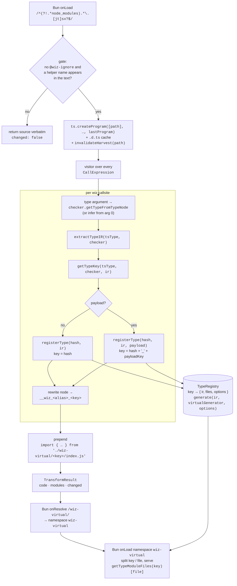

# Architecture

How wiz is put together, and why. Read this when you want to add a front end or
a back end, work out where a bug can and cannot live, or understand why two
callsites that look identical compile to two different modules. Everything here
is about the compile-time half of the project: the IR, the transform, the
registry and the virtual-module mount.

## One IR in the middle

There are two kinds of component and one thing between them. An *extractor* is
a front end: it reads some external description of types and produces IR. A
*generator* is a back end: it reads IR and produces files. Today there are
three extractors — `src/extractors/typescript.ts`, `src/extractors/openapi.ts`,
`src/extractors/proto.ts` — and a dozen generators under `src/generators/`.

The shape matters more than the count. A generator's entire interface is three
optional methods, each addressed by an IR root:

```ts
export interface Generator<TOptions = Record<string, never>> {
  name: string;
  type?(ir: TypeIR, context: GeneratorContext<TOptions>): GeneratedFiles;
  service?(ir: ServiceIR, context: GeneratorContext<TOptions>): GeneratedFiles;
  api?(ir: ApiIR, context: GeneratorContext<TOptions>): GeneratedFiles;
}
```

No generator is handed a `ts.Type`, an OpenAPI document, a `.proto` AST, or the
name of the call that produced its input. `generate()` in
`src/generators/generator.ts` dispatches on `ir.kind` alone, and a generator
that does not implement the root it was handed produces a diagnostic naming
what it *does* read rather than an empty file:

```
[wiz] generator 'wiz virtual module' cannot generate from 'api'; it reads a type
```

There is therefore no path from an input format straight to an output format.
The JSON Schema emitter cannot see that the type came from TypeScript; the
protobuf emitter cannot see that it came from an OpenAPI document. What that
buys is a specific class of bug becoming unrepresentable: a type cannot be
*described* one way and *encoded* another, because both descriptions come from
the same tree, and the `@format` reader (`declaredFormat` in `src/ir/types.ts`)
is one function shared by all of them. The README's Verification section lists
the bugs that were found this way — `repeated double` in the schema where the
codec wrote `int32`, Avro enum symbols naming members while the codec indexed
values. Each of those was a place where two back ends had drifted; there is
only one place left where they can.

The price is that anything the IR cannot hold is lost at the boundary, which is
why every root carries somewhere to report it — `ApiIR.diagnostics`, and
`GeneratorContext.logger` for the emitting side.

## The three roots

`TypeIR`, `ServiceIR` and `ApiIR` are disjoint on `kind`, so one value can be
passed anywhere and identified without an out-of-band tag.

### `TypeIR` — one type

Ten kinds, and nothing else (`src/ir/types.ts`):

| kind | carries |
|---|---|
| `primitive` | one of `string`, `number`, `boolean`, `bigint`, `null`, `undefined`, `symbol`, `unknown`, `any`, `void`, `never`, `bytes`, `date` |
| `literal` | `value: string \| number \| boolean \| bigint \| null` |
| `object` | `properties: PropertyIR[]`, `additionalProperties?: TypeIR \| boolean` |
| `array` | `element: TypeIR` |
| `tuple` | `elements: TupleElementIR[]`, `rest?: TypeIR` |
| `union` | `types: TypeIR[]`, `fieldNumbers?: number[]`, `discriminator?` |
| `intersection` | `types: TypeIR[]` |
| `enum` | `members: EnumMemberIR[]` |
| `record` | `keyType: TypeIR`, `valueType: TypeIR` |
| `ref` | `targetId: string` |

Two of those deserve a note. `bytes` and `date` are *primitives*, not objects:
`Uint8Array` and `Date` are opaque scalars on every wire wiz emits to, and
modelling them structurally would produce a message full of methods. And
`fieldNumbers` on a union is the only protobuf-specific field in the whole type
IR — it is where `NumberedUnion<{ 2: Circle; 3: Square }>` puts the numbers
TypeScript has nowhere to write. See [protobuf](./protobuf.md).

`BaseTypeIR` gives every node an `id` and an optional `name`. The `id` is
explicitly *not* globally unique — separate extractions reuse the counter — and
that has a consequence worth knowing about, covered under `walkTypeIR` below.

### `Annotated` — the constraint/description split

`BaseTypeIR` and `PropertyIR` both extend `Annotated`, which is the entire
contents of a JSDoc block split into three channels:

```ts
export interface Annotated {
  description?: string;
  deprecated?: DeprecatedInfo;
  constraints?: Constraint[];
  examples?: unknown[];
  default?: unknown;
  meta?: Record<string, (string | true)[]>;
}
```

`constraints` is the load-bearing one. A `Constraint` is a `{ kind, value }`
pair whose `kind` is drawn from a closed set of fourteen — `min`, `max`,
`minimum`, `maximum`, `exclusiveMinimum`, `exclusiveMaximum`, `minLength`,
`maxLength`, `pattern`, `format`, `multipleOf`, `minItems`, `maxItems`,
`uniqueItems`. The set is closed because every member is *enforced* by the
generated validator and maps onto a JSON Schema assertion keyword. Adding a
kind means teaching the validator about it, which is the point of keeping it a
union rather than a string.

Everything else only describes. `description`, `examples`, `default` and
`deprecated` reach documents but change no verdict. `meta` is the catch-all for
tags wiz does not model, held as arrays because `@see` legitimately repeats and
collapsing would keep only the last. `meta` is deliberately never emitted into
any output document — it exists so a doc comment is not silently lost, not so
your own tags leak into a schema. [annotations](./annotations.md) covers the
tag surface from the author's side.

### `ServiceIR` — a set of endpoints

`src/ir/service.ts`. A `ServiceMethodIR` is an address, a request, a list of
responses, and operation metadata. Two decisions shape it:

**Responses are a list, not a union.** A method genuinely has a 200 *and* a 404
*and* a 500 at once, so they must all be held rather than chosen between. The
flat operation IR this replaced could not say that; `test/service_ir.test.ts`
keeps a `describe` block named after exactly that gap.

**Protocol is a discriminant repeated at every level.** `address`, `request`
and every response carry their own `protocol`, and `ServiceMethodIR` repeats it
so a whole method narrows in one check:

```ts
const method: ServiceMethodIR = {
  kind: "serviceMethod",
  protocol: "http",
  address: { protocol: "http", method: "GET", path: "/users/{id}" },
  request: { protocol: "http", parameters: params(pathParamsIR, "path") },
  responses: [
    {
      protocol: "http",
      status: 200,
      body: [{ mimetype: "application/json", content: userIR }],
    },
  ],
};
```

The repetition is what lets a sub-IR be passed around detached and stay
self-describing — an OpenAPI emitter that is handed an address alone still
knows whether it can render one. `isHttpMethod` / `isGrpcMethod` are the
narrowing seams. `ServiceIR` itself holds only `name`, `version`, `description`
and the methods: `servers`, `security` and `info` are absent on purpose,
because they are per-environment runtime values that arrive through the base
document.

### `ApiIR` — a whole document

`src/ir/api.ts`. A `version` (`"3.0"`, `"3.1"` or `"proto3"`), a `types` map,
four component registries, a `ServiceIR`, and `diagnostics`.

Components are kept as registries rather than dereferenced away, so a model or
client emitter can name what the document named — `components.schemas` keys and
`$ref` targets survive into generated TypeScript. Operations reference them by
name *and* carry the resolved value, so a consumer that does not care about
reuse can ignore the registries entirely. `diagnostics` holds a JSON pointer,
the offending keyword and a message for every construct the IR could not
represent, which is how `not` in a source document or `extend` in a `.proto`
becomes a reported fact rather than a silent omission. See
[extractors](./extractors.md).

## Normalisation and structural hashing

Two functions in `src/ir/types.ts` decide when two types are the same type.

`normalizeTypeIR(ir, withNames = false)` projects a tree onto a canonical
form: short keys, object properties sorted by name, union and intersection
members sorted by their serialised form, enum members sorted, constraints
sorted by kind then value, `meta` entries sorted by tag. Everything sorted
because declaration order is not part of a type's meaning, and *deterministic*
because the result is fed to a hash.

`computeTypeIRHash(ir)` is `fnv1a(JSON.stringify(normalizeTypeIR(ir)))` — an
eight-character hex string. FNV-1a rather than a cryptographic hash because
this runs once per callsite per build and nothing security-relevant depends on
it; collisions would produce a wrong module, which is why the projection is
careful rather than the hash wide.

The rule the projection has to satisfy is stated in
`test/ir_contracts.test.ts`: *every field a generator emits has to reach the
key, or two modules that differ collapse onto one entry.* The tests enumerate
the fields — a root `description`, `deprecated`, `constraints`, `examples`,
`default`, `meta`, a property's `fieldNumber`, a union's `discriminator` — and
assert each one separates two otherwise identical types:

```ts
const bare = computeTypeIRHash(object());
expect(computeTypeIRHash(object({ description: "docs" }))).not.toBe(bare);
expect(computeTypeIRHash(object({ meta: { since: ["1.1"] } }))).not.toBe(bare);
```

`withNames` is the one deliberate asymmetry. A bare type module — keys, JSON
Schema, validator, codecs — emits no type name anywhere in its output, so two
identical shapes called `User` and `Admin` legitimately share it. A document or
schema-text payload *does* emit names, as `components.schemas` keys, `$ref`
targets and protobuf message names, so those keys ask for them:

```ts
expect(computeTypeIRHash(user)).toBe(computeTypeIRHash(admin));
expect(normalizeTypeIR(user, true)).not.toEqual(normalizeTypeIR(admin, true));
```

`normalizeServiceMethod` in `src/ir/service.ts` is the same idea for a service
method, and lives there rather than in the plugin precisely because the
registry keys on it too. It normalises payload types *with* names, since an
operation renders them as `$ref`s, and it keys every field the operation object
renders — down to a parameter's `description` and `deprecated` flag. For gRPC
it keys the streaming flags, because those change the emitted signature as much
as the message types do.

`walkTypeIR(ir, visitor, visited?)` is the traversal every analysis pass uses.
It breaks cycles on *node identity*, not on `id`, and the reason is the
non-uniqueness noted earlier: an id-keyed walk sharing one `visited` set across
two extractions would silently skip nodes from the second graph. There is a
test for it, because it was a real bug:

```ts
const first: TypeIR = { id: "o_1", kind: "object", properties: [], name: "First" };
const second: TypeIR = { id: "o_1", kind: "object", properties: [], name: "Second" };
const visited = new Set<TypeIR>();
walkTypeIR(first, (n) => seen.push(n.name ?? ""), visited);
walkTypeIR(second, (n) => seen.push(n.name ?? ""), visited);
expect(seen).toEqual(["First", "Second"]);
```

## The transform pipeline



`transformSource` in `src/plugin.ts` is the whole thing, and it is shared by
the Bun plugin and `wiz eject` so that what a build runs and what an eject
writes cannot diverge. Step by step:

**1. File selection.** `wizPlugin()` registers one `onLoad` hook with the
filter `/^(?!.*node_modules).*\.[jt]sx?$/`. The negative lookahead is not
cosmetic: returning contents for a `node_modules` file makes Bun treat a
CommonJS dependency as ESM and lose its default export.

**2. The text gate.** Before any compiler work, `transformSource` bails on two
substring checks — the file contains `@wiz-ignore`, or it contains none of the
nineteen names in `HELPER_FUNCTIONS`. A gate on raw text rather than on the AST
because building a `ts.Program` is the expensive part and most files in a
project mention nothing. When it fires, the *original* text is returned
unchanged; the printer never touches a file wiz has no business in.

**3. The program.** A `ts.Program` is built per transformed file, rooted at
that file, with a compiler host whose `readFile` returns the in-memory
contents. Two caches make that affordable: `declarationFileCache` shares parsed
`.d.ts` `SourceFile`s across every per-file program (without it the whole of
`lib.d.ts` is re-parsed each time, which dominates build time), and the
previous program is passed as `oldProgram` so TypeScript can reuse the binding
of everything that did not change. `invalidateHarvest(path)` runs first: a
second transform of one path means the build is running again, so a document
harvested last time may describe source that is already gone.

**4. Finding callsites.** One `ts.Visitor` walks every node. On a
`CallExpression` it reads the callee name — from an `Identifier` or the
`.name` of a `PropertyAccessExpression`, so `openapiSchema.get(…)` is seen too
— and dispatches. Two cases are not type-driven at all:

- `openapiDocument()` with no arguments is answered from the whole program by
  `harvestDocument` and inlined as an AST literal by `jsonToExpression`, so no
  fragment registry survives into the bundle. Under `isolated: true` — a
  single-file eject — it throws instead, naming the project form as the fix.
- `openapiSchema<[Service]>(base)` collapses to a call into the virtual module
  that holds the finished document.

There is no route adapter: a router is written as its framework documents it,
and a document is derived from the service declarations the handlers implement.
See [openapi](./openapi.md).

**5. Type argument to IR.** For the remaining helpers the first type argument
is resolved with `checker.getTypeFromTypeNode`; with no type argument the type
is inferred from the first value argument, which is what makes `validate(arg)`
work. Then two calls, in this order:

```ts
const ir = extractTypeIR(tsType, checker);
const hash = getTypeKey(tsType, checker, ir);
```

Everything after this point sees only `ir` and `hash`. The `ts.Type` and the
checker go no further — that is the front-end boundary from
[type-introspection](./type-introspection.md) enforced by construction.

**6. Registration.** Two paths. `wantExport(name)` calls `registerType(hash,
ir)` with no options and records the export name against the bare hash.
`registerPayload(exportName, payload)` calls `registerType(hash, ir, payload)`
and records against the returned *key*, which differs. Registration is lazy on
purpose: a callsite that only wants a payload module must not also emit an
empty module for the type it was derived from.

**7. Rewriting.** Each callsite becomes a reference to a generated name. A
value-like helper becomes a bare identifier; a function-like one keeps its
arguments, visited recursively so nested wiz calls are transformed too:

```ts
export const k = keysOf<User>();
export const check = (v: unknown) => is<User>(v);
```

becomes, verbatim from a real run:

```ts
import { keys as __wiz_keys_b8df6d03__tmp_demo_ts_User, is as __wiz_is_b8df6d03__tmp_demo_ts_User } from "./wiz-virtual/b8df6d03__tmp_demo_ts_User/index.js";
export const k = __wiz_keys_b8df6d03__tmp_demo_ts_User;
export const check = (v: unknown) => __wiz_is_b8df6d03__tmp_demo_ts_User(v);
```

The local names come from `VIRTUAL_EXPORTS`, a table mapping each generated
export to its alias prefix, and `localAlias(exportName, key)` which joins the
prefix to the key. Both are exported, because `eject` inlines those modules and
has to bind the names the rewritten code refers to; a second copy of the table
would be one more pair of things that can drift.

**8. Imports and the result.** One import declaration is emitted per key, with
specifiers ordered by `Object.keys(VIRTUAL_EXPORTS)` so the output is stable,
and the specifier is always `./wiz-virtual/<key>/index.js`. Under `inline:
true` the imports are omitted — the caller puts the definitions in scope
another way, which is how a single-file eject produces one self-contained file.

If the visitor never set `modified`, the original text is returned and
`changed` is `false`. Otherwise:

```ts
export interface TransformResult {
  /** The rewritten source. */
  code: string;
  /** Generated modules by mount root, the prefix `code`'s imports start with. */
  modules: Map<string, GeneratedModule>;
  /** False when the file had nothing for wiz to do. */
  changed: boolean;
}
```

`modules` is keyed by mount root — `./wiz-virtual/<key>` — which is exactly the
prefix the emitted imports start with, so a driver can match one to the other
without re-deriving anything. Each `GeneratedModule` carries `files` (the
generator's filename-to-contents map), `exports` (the names this file actually
used, in request order) and `hash` (the key). `exports` exists for an inlining
caller: the module defines far more than any one file uses.

That distinction is the only difference between the two drivers. For a bundler,
`files` is the registry's own — every generator, because other files share the
module by key and the bundler drops the rest. For `inline`, the module is
*regenerated* with `{ ...entry.options, only: exports }`, through the same
generator the registry ran, because inlined code is read by a person and
several hundred lines of unreachable codec is noise. Same emitter, narrower
request; never a second emission path. See [cli](./cli.md).

## Module identity

Two functions compose to make a key.

### `getTypeKey` — the type half

`src/types.ts`. A named type gets a key built from where it was declared:

```
fnv1a(normalizeTypeIR(ir))  +  "_"  +  sanitize(fileName + ":" + symbolName [+ "<" + argKeys + ">"])
```

so `User` declared in `/tmp/demo.ts` keys as
`b8df6d03__tmp_demo_ts_User`. Generic arguments are appended, each named by its
own declaration site or, failing that, by `checker.typeToString`. Anonymous and
inline types fall back to the bare structural hash — which is why the tuple in
`openapiSchema<[User], "3.0">()` keys as `b8210b23` with no suffix.

The structural hash leads and the symbol path follows, so identity is still
content-addressed; the suffix is there to make a key readable in a stack trace
and to keep two same-shaped types from different files distinguishable in
output a human reads. Symbols declared inside `node_modules/typescript/lib` are
skipped, and the whole suffix is run through `replace(/[^a-zA-Z0-9_]/g, "_")`.
That sanitisation is load-bearing for the mount, as the next section explains.

### `payloadKey` — the generator half

`src/registry.ts`. `registerType` composes the two:

```ts
const key = options ? `${typeHash}_${payloadKey(options)}` : typeHash;
```

`payloadKey` hashes every field of `VirtualModuleOptions` that changes the
emitted code: the OpenAPI types and version, the normalised service methods,
the protobuf/Avro/Arrow schema type lists, and the `arrow` and `zod` flags.
Named type lists go through `namedTypesKey`, which normalises *with* names,
since those names become `components.schemas` keys and `$ref` targets.

One field is deliberately absent, with a comment saying so: `only` is applied
when the module is emitted, never at registration, so it cannot distinguish two
registered modules.

### Why the payload is part of the key

Because it once was not, and the result was a silent miscompile. The registry
keyed on the type alone and overwrote the entry in place when a payload
arrived, so two callsites sharing a type but differing in payload collided and
whichever transformed last redefined the other. The whole of
`test/registry_keys.test.ts` is regressions for that, and its header comment
says as much.

The clearest case is two dialects of one document:

```ts
import { openapiSchema } from "wiz";
export interface User { id: string; name: string }
export const v30 = openapiSchema<[User], "3.0">();
export const v31 = openapiSchema<[User], "3.1">();
```

Same type, same structural hash, different output. With the payload in the key
they are two modules, and the test asserts exactly that — two generated modules
mentioning `openapiSchema`, whose documents declare `3.0.3` and `3.1.0`. What
the rewriter emits, from a real run:

```ts
import { openapiSchema as __wiz_openapiSchema_b8210b23_68c92e48 } from "./wiz-virtual/b8210b23_68c92e48/index.js";
import { openapiSchema as __wiz_openapiSchema_b8210b23_b92d550b } from "./wiz-virtual/b8210b23_b92d550b/index.js";
export const v30 = __wiz_openapiSchema_b8210b23_68c92e48();
export const v31 = __wiz_openapiSchema_b8210b23_b92d550b();
```

One type hash, two payload hashes, two mounts. The rest of the file covers the
other shapes of the same collision:

- **Different operations.** Two `openapiSchema<[]>({}, [...])` calls whose only
  difference is a path — `/users` versus `/people` — are two modules, because
  `payloadKey` runs the harvested methods through `normalizeServiceMethod`.
- **A codec and a schema of one type.** `protobufSchema<[User]>()` and
  `encodeProto<User>(…)` in one file produce two entries: the schema payload
  earns its own module, the codec keeps the bare type key. Exactly one carries
  the `.proto` text, and `result.modules.size` is 2.
- **A changed doc comment.** Two transforms of the same file differing only in
  a `/** … */` produce modules containing `first revision` and `second
  revision` respectively. This is `normalizeAnnotations` inside the *type*
  hash, not `payloadKey`, and it is why annotations are keyed unconditionally.
- **A nested component name.** `openapiSchema<{ profile: User }>({})` versus
  the same with `Admin`: identical structure, identical path, but the nested
  name decides both the `$ref` and the `components.schemas` key. The `Admin`
  document must contain `"Admin"` and must not contain `"User"`. This is what
  `withNames` exists for.
- **A changed field number.** `@fieldNumber 1` versus `@fieldNumber 2` is a
  different wire contract, so `normalizeTypeIR` keys `fn` on every property —
  a protobuf field number is the wire contract, not a comment.

And the negative case, which is the whole point of content addressing: two
*identical* `openapiSchema<[User], "3.1">()` callsites in one file yield
`result.modules.size === 1`.

`registerType` reads as content-addressed because of all this. It looks the key
up, returns the existing entry if there is one, and otherwise generates once:

```ts
const existing = TypeRegistry.get(key);
if (existing) return existing;
```

An entry is only ever written once, never mutated, because anything that would
change the generated code is already in the key. Nothing overwrites; nothing
can silently redefine anything.

## Virtual modules

The registry holds `GeneratedFiles` — a `Record<string, string>` — per key. The
mount turns that into something Bun can import. `src/virtualPlugin.ts` is
seventy-nine lines and does four things.

**The layout is `wiz-virtual/<key>/<file>`.** `MOUNT` is the literal string
`"wiz-virtual/"`, and `VIRTUAL_ENTRY` is `"index.js"`.

**`onResolve` claims the namespace.** A filter of `/wiz-virtual/` matches the
specifier anywhere in the string and returns the path *verbatim* under
namespace `wiz-virtual` — no disk resolution, because there is no disk entry to
resolve against.

**A second `onResolve` keeps relative imports inside the mount.** A filter of
`/^\.\.?(\/|$)/` catches every relative specifier in the build; it returns
`undefined` — deferring to normal resolution — unless the *importer* is inside
a mount, in which case the specifier is joined against `dirname(importer)` and
kept in the namespace. `./x.js` from `wiz-virtual/<key>/index.js` names a
sibling in the same generated module, not a file next to the importer's
original source. This is what makes a multi-file generated module possible.

**`onLoad` serves the bytes.** It strips a leading `./`, slices off the mount
prefix, splits at the first slash, and looks the pair up:

```ts
const mounted = args.path.replace(/^\.?\//, "").slice(MOUNT.length);
const boundary = mounted.indexOf("/");
const key = boundary === -1 ? mounted : mounted.slice(0, boundary);
const file = boundary === -1 ? VIRTUAL_ENTRY : mounted.slice(boundary + 1);

const contents = getTypeModuleFiles(key)?.[file];
```

Splitting at the first slash is sound because a key is one path segment by
construction — that is what `getTypeKey`'s sanitisation guarantees. A key that
ever broke the rule fails the lookup and names itself in the error rather than
mounting the wrong file:

```
[wiz] Virtual module for hash '<key>' has no file '<file>'.
```

A bare `wiz-virtual/<key>` with no file part resolves to `index.js`. The entry
is a convention rather than a manifest for a mundane reason: a generator's
contract is a file map, but the rewriter has to name one file of it in an
import specifier, and a convention needs no extra channel to carry. The loader
is picked by extension — `ts` for `.ts`, `js` for everything else.

### The one thing that does not work in a mount

A bare package import cannot resolve there. `wiz-virtual/<key>/index.js` has no
location on disk, so it has no `node_modules` above it and no package to
resolve `import "zod"` against. The second `onResolve` hook handles relative
specifiers precisely because those are the ones a mount *can* answer; a bare
specifier has no answer to give.

This is why the zod back end never names zod. `zodSchema<T>()` is rewritten to
pass a loader from the callsite — from the consumer's own file, where `zod`
does resolve:

```ts
export const s = __wiz_zodSchema_042b1e16__tmp_demo3_ts_User_df71fc12(() => import("zod"));
```

It stays a dynamic import, so zod loads on first use and never if the schema
goes unused, which is also what lets zod be an optional peer dependency. Note
the key: `<typeHash>_<symbolPath>_<payloadHash>` — asking for zod is a payload
(`{ zod: true }`), because the module's content depends on it. Full treatment
in [zod](./zod.md).

## Deduplication

Identical types share one generated module across files. `test/plugin.test.ts`
covers it with two fixtures that are byte-identical apart from their names,
both importing `Item` from a third file; both get the same keys and the same
validator verdicts, from one registered module.

"Identical" means *the same key*, which decomposes into everything above:

- the same normalised structure — properties sorted, unions sorted, so
  declaration order is irrelevant;
- the same annotations on every node, root and property alike, so a changed doc
  comment is a different module;
- the same declaration site and generic arguments, when the type is named;
- the same generator payload, so a 3.0 document and a 3.1 document of one type
  are two modules;
- and, for payloads only, the same *names* throughout the tree.

Two consequences follow. Positively: `is<User>(a)` in two files imports the same
function, and the registry generates it once. Negatively: the registry is
module-global (`const TypeRegistry = new Map(...)`) and outlives one transform,
which is why `clearTypeRegistry()` exists and why the key tests call it in
`beforeEach`. A test that transforms the same source twice with different doc
comments is only meaningful against an empty registry.

## Limitations

**One `ts.Program` per file.** Each transformed file is its own root, so
program reuse through `oldProgram` is partial. The `.d.ts` cache and the text
gate carry most of the cost, but a large project still pays for a program per
file that mentions a helper.

**The gate is a substring match.** A file containing the word `schema` in a
comment builds a full program and gets nothing out of it. The false positives
are cheap in aggregate and the alternative — parsing first — is not.

**The registry is process-global and never evicts.** Entries accumulate for the
life of the process, keyed by content. In a long-running watch process, every
revision of a type that ever compiled is still held.

**Only `TypeIR` reaches the plugin's own generator.** `virtualGenerator`
implements `type` and nothing else: a virtual module is what one type compiles
to. `ServiceIR` and `ApiIR` are reachable only through
[cli](./cli.md)'s `wiz generate`, not through a callsite.

**The `wiz` import survives the rewrite.** The transform replaces callsites but
leaves the original `import { keysOf } from "wiz"` declaration in place, with
its bindings simply unreferenced. The runtime stubs are still resolved and
loaded even in a file where nothing of wiz remains at runtime.

**`ref` nodes are not followed by `walkTypeIR`.** A `RefTypeIR` carries a
`targetId` and the walk treats it as a leaf, so a pass that needs the target
has to resolve it itself against whatever map the extractor produced.

**Hash width.** Keys are 32-bit FNV-1a, printed as eight hex characters. Two
genuinely different normalised trees colliding would mount the wrong module.
Nothing has observed one, and the projection is tested field by field precisely
because the hash is not wide enough to be careless with.
